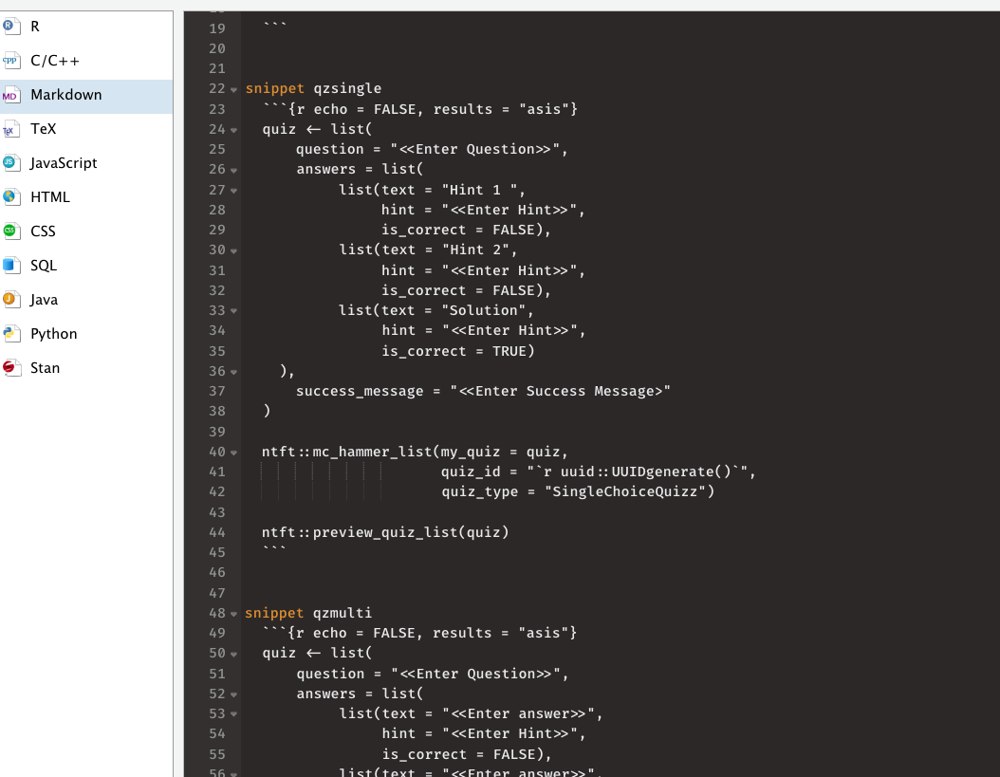

## How to install `{ntft}`

```r
remotes::install_github("https://github.com/gruggeri/ntft")
```

## How to use `mc_hammer()`


The quiz should look like the following:

``` r
myquiz <- '
{
"question": "Which function do we usually use to load shapes?",
"answers": [
{"text": "`read_st()`",
"hint": "",
"is_correct": false},
{"text": "`read_csv()`",
"hint": "Nope. Usually shapes are not stored into .csv files, although this might happen sometimes.",
"is_correct": false},
{"text": "`st_read()`",
"hint": "Bravo.",
"is_correct": true},
{"text": "`st_read_csv()`",
"hint": "Nope.",
"is_correct": false},
{"text": "`raster()`",
"hint": "Nope. This function is used to load rasters, not shapes.",
"is_correct": false}
],
"success_message": "Good job!"
}

'
```

The difference with the previous version is that, for instance.
`question:` has been transformed into `"question":`. This is valid for
all the other arguments (e.g. text, hint, is\_correct): they should all be
in quotations.

In order to change this, you can use the <kbd>shift + command + f</kbd>, and
change these patterns in all your files in the **chosen directory**. 
**Do it at subject level only, to avoid potential mistakes and git conflics.**

The reasons why we decided to go this way, is to be consistent with JSON
syntax. 


Also note that we are now wrapping the entire quiz in single quote (`'`) to convert it to a long string that we save in a variable (here `myquiz`).
We picked single quote because the JSON is already full of double quotes.
If you need to use single quotes in the JSON (e.g. for writing contractions like `ain't`), remember to escape them with a backslash (i.e. `ain\'t`).

We can now use `mc_hammer()` on your `myquiz`.

> Beware that you need to imput your own `quiz_id`, which needs to be
> unique, as it is saved in a platform database.

In order to print the HTML code in the .md file, use as a chunk option
`echo = FALSE, results = 'asis'`.

``` r
mc_hammer(my_quiz = myquiz, quiz_id = "myid", quiz_type = "MultipleChoiceQuizz")

```

<!--html_preserve-->

<div data-type="MultipleChoiceQuizz" data-permanent-id="myid" data-json="{&quot;description_md&quot;:&quot;Which function do we usually use to load shapes?&quot;,&quot;answers_attributes&quot;:[{&quot;text_md&quot;:&quot;`read_st()`&quot;,&quot;hint_md&quot;:&quot;&quot;,&quot;correct&quot;:false,&quot;permanent_id&quot;:1},{&quot;text_md&quot;:&quot;`read_csv()`&quot;,&quot;hint_md&quot;:&quot;Nope. Usually shapes are not stored into .csv files, although this might happen sometimes.&quot;,&quot;correct&quot;:false,&quot;permanent_id&quot;:2},{&quot;text_md&quot;:&quot;`st_read()`&quot;,&quot;hint_md&quot;:&quot;Bravo.&quot;,&quot;correct&quot;:true,&quot;permanent_id&quot;:3},{&quot;text_md&quot;:&quot;`st_read_csv()`&quot;,&quot;hint_md&quot;:&quot;Nope.&quot;,&quot;correct&quot;:false,&quot;permanent_id&quot;:4},{&quot;text_md&quot;:&quot;`raster()`&quot;,&quot;hint_md&quot;:&quot;Nope. This function is used to load rasters, not shapes.&quot;,&quot;correct&quot;:false,&quot;permanent_id&quot;:5}],&quot;success_message_md&quot;:&quot;Good job!&quot;}">

</div>

<!--/html_preserve-->

This will print the HTML code in the md file, even though you will not
see it printed in the preview (nor in github). 

You can now copy and paste the md file on the platform.


## use `preview_quiz()` to visualize the quiz on Github and the preview

``` r
preview_quiz(my_quiz = myquiz)
```

## If you are lazy, use `mc_lazy_quotes()`

The function `mc_lazy_quotes()` helps you not having to use <kbd>shift + command + f</kbd> to find a replace the patterns, it will also get rid of smart quotes.
I would suggest you to use it only until the soft launch, and then use the new quiz template from the beginning.


### Example

``` r

myquiz <- ' {
question: "Which function do we usually use to load shapes?",
answers: [
{text: "`read_st()`",
hint: "",
is_correct: false},
{text: "`read_csv()`",
hint: "Nope. Usually shapes are not stored into .csv files, although this might happen sometimes.",
is_correct: false},
{text: "`st_read()`",
hint: "Bravo.",
is_correct: true},
{text: "`st_read_csv()`",
hint: "Nope.",
is_correct: false},
{text: "`raster()`",
hint: "Nope. This function is used to load rasters, not shapes.",
is_correct: false}
],
success_message: "Good job!"
}

'

# this replaces the find shift+command+F

myquoted_quiz <- mc_lazy_quotes(myquiz)

# this exports the quiz to HTML

mc_hammer(my_quiz= myquoted_quiz, quiz_id = "myid", quiz_type = "MultipleChoiceQuizz")

# this creates the preview 

preview_quiz(myquoted_quiz)


```


## Instructions to make new quizzes

The best solution to make new quizzes, from now on, is to actually use R list.
When you create lists, you can use `mc_hammer_list()`
In order to ease the process you can add to your RStudio the following snippets:

```
snippet qzsingle
```
	```{r echo = FALSE, results = "asis"}
	quiz <- list(
	    question = "<<Enter Question>>",
	    answers = list(
	         list(text = "Hint 1 ",
	              hint = "<<Enter Hint>>",
	              is_correct = FALSE),
	         list(text = "Hint 2",
	              hint = "<<Enter Hint>>",
	              is_correct = FALSE),
	         list(text = "Solution",
	              hint = "<<Enter Hint>>",
	              is_correct = TRUE)
	  ),
	    success_message = "<<Enter Success Message>"
	)
	
	ntft::mc_hammer_list(my_quiz = quiz,
			     quiz_id = "`r uuid::UUIDgenerate()`",
			     quiz_type = "SingleChoiceQuizz")

	ntft::preview_quiz_list(quiz)
	```

```	
snippet qzmulti
```
	```{r echo = FALSE, results = "asis"}
	quiz <- list(
	    question = "<<Enter Question>>",
	    answers = list(
	         list(text = "<<Enter answer>>",
	              hint = "<<Enter Hint>>",
	              is_correct = FALSE),
	         list(text = "<<Enter answer>>",
	              hint = "<<Enter Hint>>",
	              is_correct = FALSE),
	         list(text = "<<Enter answer>>",
	              hint = "<<Enter Hint>>",
	              is_correct = TRUE)
	  ),
	    success_message = "<<Enter Success Message>>"
	)
	
	ntft::mc_hammer_list(my_quiz = quiz,
		             quiz_id = "`r uuid::UUIDgenerate()`",
			     quiz_type = "MultipleChoiceQuizz")

	ntft::preview_quiz_list(quiz)
	```


In order to add these snippets going to <kbd>RStudio preferences -> code -> enable code snippets ->Edit Snippets -> chose Markdown snippets (on the left)</kbd> -> paste there your snippets


	
	
	
